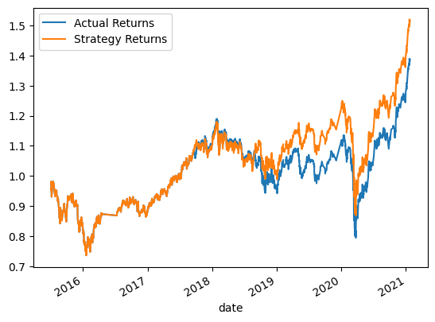
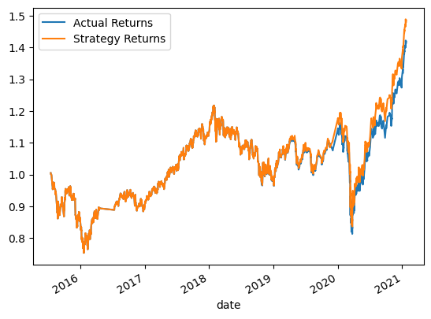
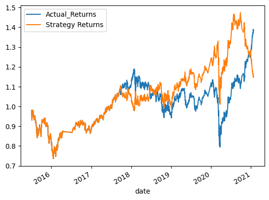

# Algorithmic_Trading_Models
Provides multiple machine learning solutions to improve a algorithmic trading model for OHLCV -- a Morgan Stanley Capital International (MSCI) IShares Fund

# Evaluation Report 

## Baseline Trading Algorithm

Using the SVC classifier from SKLearn's support vector (SVM) learning method, we were able to build a model using the firm's current trading algorithm, which will serve as the baseline for our evaluation.  The underlying data was utilized to calculate a moving average of 4 and 100 days, then labeled 'SMA_Fast' and 'SMA-Slow', respectively. We then created a column within the data frame which we called "Signal", which was assigned values of 1 or -1. 1 signaling we are 'long' or intend to buy the stock, with -1 signaling we are going short on the stock. The dataset was trained and tested using 'SMA_Fast' and 'SMA_Slow' as the feature inputs within the model to predict our target set of 'Signal'. The classification report on the baseline algorithm returned an overall accuracy of 0.55 and was much more efficient with the 1.0 signal, or going long and buying stock. The 1.0 signal returned ratings of 0.56 for precision, and 0.96 for recall, and had an f1-score of 0.71. Our baseline model was not great with the -1.0 signal, however, or shorting the asset. Signal -1.0 returned ratings of 0.43 for precision, only 0.04 for recall, and an f1-score of 0.07. 

After calculating our returns based on the predictions of our model, we plotted the algorithmic trading model's strategy returns against the actual returns of the underlying asset. The results are as follows below.

## Tuned Baseline Algorithm

After establishing our baseline model, we then created multiple new models, with the same dataset, that tuned the algorithm by adjusting the size of the dataset and adjusting the SMA input features. The most efficient, model that was tested used tuned moving average windows by adjusting our 'SMA_Fast' to 10 days and implementing a 150-day window for "SMA_Slow". The classification report on the tuned, baseline algorithm returned a, slightly better, overall accuracy of 0.56, compared to a 0.55 accuracy from the original baseline model. Again, the 1.0 signal was much more efficient with the following returned ratings of 0.56 for precision, and 1.00 for recall, and had an f1-score of 0.72. Our tuned model also was less efficient on the -1.0 signal, returning ratings of 0.58 for precision, only 0.01 for recall, and an f1-score of 0.02. 

After calculating our returns based on the predictions of our updated model, we plotted the trading algorithm's strategy returns against the actual returns of the underlying asset. The results are as follows below.

## New Algorithm With New Machine Learning Classifier

For our final model, we reverted to using the original parameters from the baseline model but instead used a new classifier to build the model. To accomplish this we used a LogisticRegression model from the SKLearn library. The classification report on the LogisticRegression algorithm returned an overall accuracy of 0.52 but this performed much better with the -1.0 signal but performed much worse with the 1.0 signal compared to the previous two models. The 1.0 signal returned ratings of 0.56 for precision, and 0.66 for recall, and had an f1-score of 0.61. Signal -1.0 returned ratings of 0.44 for precision, 0.33 for recall, and an f1-score of 0.38.

Our LogisticRegression trading algorithm's strategy returns against the actual returns of the underlying asset were plotted below.

## Conclusion
In terms of strategy returns, the original baseline model predicted the highest returns and most potential compared to the other models created. I would continue using the baseline model until a more efficient model is found. 